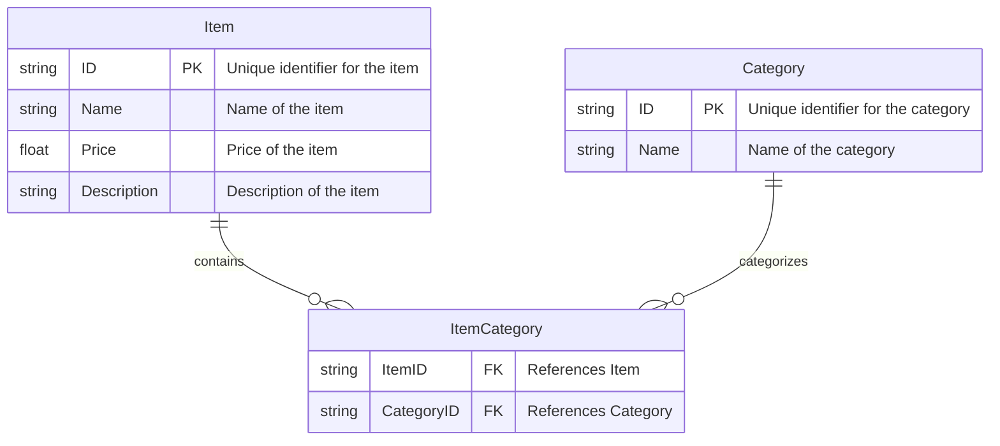

# Simple Online Store Admin

## Project Description

This project is a basic web application that serves as an admin interface for a simple online store. It allows the store administrator to manage store items and categories, including adding, removing, and associating items with categories. The application uses a Redis database to store data and is built using Go with the `net/http` package for handling web requests and the `html/template` package for rendering the UI.

> Note that we are even using my own Redis server implementation for this project, which I developed 5 years ago to learn some Go.

## Use Cases

- **Adding Items**: Admin can add new items to the store with a name, price, and description.
- **Removing Items**: Admin can remove existing items from the store.
- **Adding Categories**: Admin can add new categories to organize items.
- **Removing Categories**: Admin can remove existing categories.
- **Associating Items with Categories**: Admin can associate items with one or more categories.
- **Disassociating Items from Categories**: Admin can remove the association between items and categories.

## Setup Instructions

To set up the development environment for this project, follow these steps:

1. Ensure you have Go installed on your system. You can download it from [the Go website](https://golang.org/dl/).
2. Clone the repository to your local machine.
3. Run the application and redis server with `go run app.go`.
4. Access the web application by visiting `http://localhost:8080` in your web browser.

## Data Model Diagram

## Contribution List

- Designed and implemented the data model for items and categories with a many-to-many relationship.
- Developed the web server and routing logic using the `net/http` package.
- Created HTML templates for the UI using the `html/template` package.
- Integrated the Redis database using the `github.com/go-redis/redis/v8` package.
- Handled form processing and input validation for adding and removing entities.

## Team Contributions

This project was developed by a single author, me.